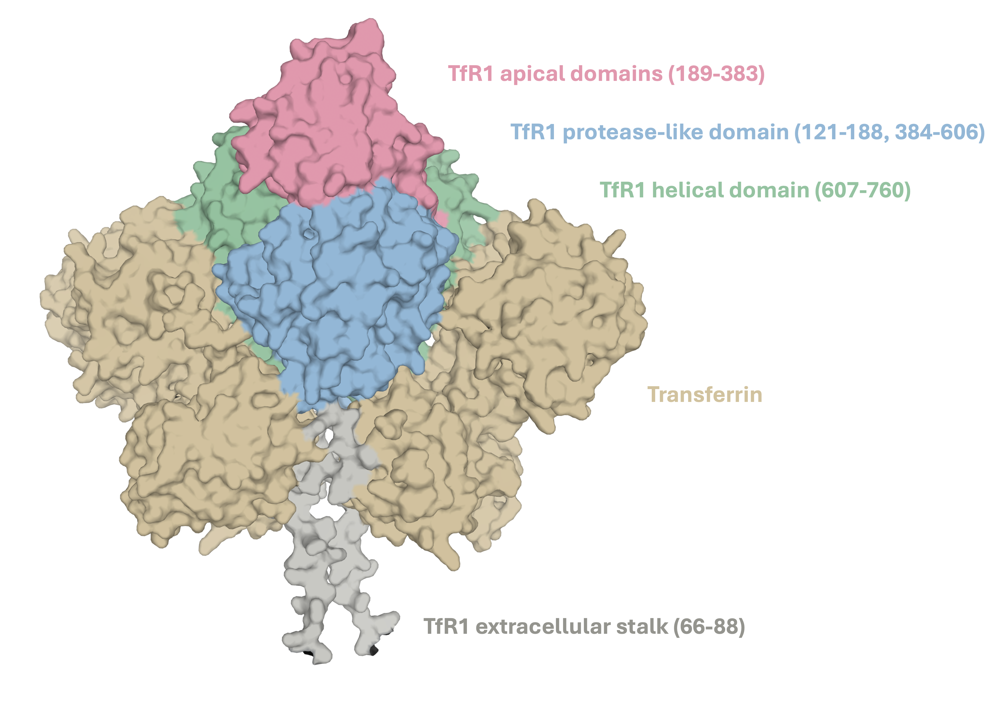
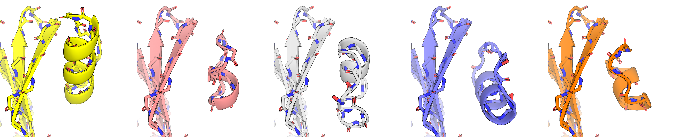
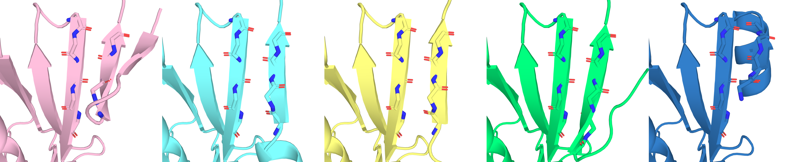

# A Exploration of De Novo Peptide Design for Brain-Targeting Peptides Shuttles Bearing Therapeutic Cargo

By David Kouvchinov, PhD

## Motivation

I am interested in applying for a post-doctoral position regarding the de novo design of brain-targeting peptides in the context of ischemic stroke, as part of a larger interdisciplinary project. Below, I explore some of the background surrounding ischemic stroke, related therapeutic targets, promising leads/clinical efforts, and the use of peptides shuttles to target the brain. This exploration led me to consider that targeting Transferrin Receptor 1 (TfR1) with lariat macrocycles may allow for receptor-mediated transcytosis of PSD-95 inhibitor payload across the blood brain barrier (BBB). Following, I apply the de novo peptide/protein design, RFpeptides, to design potential TfR1 binding peptides that may be suitable in this context.

## Background

Stroke is a potentially fatal or otherwise debilitating medical condition in which blood flow to areas of the brain are disrupted. According to the CDC, strokes were responsible for 1 in 6 deaths from cardiovascular disease in US circa 2022, with > 795K Americans suffering a stroke each year. In addition to premature mortality, stroke is also a leading cause of serious long-term disability ([Tsao et al., 2023](https://doi.org/10.1161/CIR.0000000000001123)). Strokes are classified as either ischemic, due to a lack of bloodflow, or hemorrhagic, due to internal bleeding. Ischemic strokes represent the most common form of stroke; nearly 90% of strokes are ischemic. Reperfusion therapies (therapies meant to restore blood flow to the affected area) are a critical first-line treatment for acute ischemic stroke. They can be divided as: intravaneous thrombolysis (administration of a clot-dissolving medication like intravenous altepase) or mechanical thrombectomy (physical removal of a blood clot with specialized catheters). These therapies are vital and can salvage brain tissue in appropriate contexts, but may be insufficient to rescue further complex downstream pathology arising from ischemic injury or injury occuring from the reperfusion itself ([Weiss and Ding, 2026](https://doi.org/10.1159/000547092)). This has motivated efforts towards nueroprotective agents that could function as adjunctive therapies to ameliorate such downstream pathophysiology.

Excitotoxicity is one such downstream pathophysiological state of ischemic stroke. It is defined by the nueronal damage caused by the excess release of glutamate and subsequent activation of excitatory cell membrane receptors ([Shen et al., 2022](https://doi.org/10.1016/j.biopha.2022.113125); [Qin et al., 2022](https://doi.org/10.1038/s41392-022-01064-1); [Neves et al., 2023](https://doi.org/10.1016/j.lfs.2023.121814)). At a high level, the process towards excitotoxicity can be described as such: upon loss of blood flow in ischemic conditions, neurons lose access to glucose and oxygen, limiting their capacity to produce ATP. In this low energy state, ion pumps that depend on ATP subsequently begin to fail, disrupting the gradients of Na+/K+/Ca2+ and leading to neuron depolarization. Consequently, glutamate is released (in excess) to the extracellular space. This excess glutamate can not be entirely cleared by various transporter proteins or other astrocyte processes and instead activates nearby transmembrane glutamate receptors of surrounding neurons, such as N-methyl-D-aspartate receptors (NMDARs). Overstimulation of NMDARs, a subset of ligand-gated ion channels that mediate Ca2+ flux, leads to excess influx of Ca2+ into the neuron and activation of calcium dependent enzymes, cumulatively promoting various cell death signals and general excitotoxic damage.

Considering the prominent role of NMDARs in ischemic excitotoxicity, early approaches towards neuroprotection focused on administration of NMDAR antagonists. Indeed, in rat models of ischemia, focal microinfusion of the NMDAR antagonist, 2-amino-7-phosphonoheptanoic acid, into relevant brain tissue was shown to be neuroprotective against the development of ischemic injury ([Simon et al., 1984](https://doi.org/10.1126/science.6093256)). However, direct antagonism of NMDARs has been associated with neurotoxicity in clinical trials. Selfotel, a small-molecule competitive NMDAR antagonist, was discontinued in phase 3 ischemic stroke trials due to a lack of efficacy and higher mortality in the treatment arm, plausibly due to neurotoxicity ([Davis et al., 2000](https://doi.org/10.1161/01.STR.31.2.347)). Considering that NMDARs mediate essential nueronal excitation in brain regions unaffected by ischemia, more targeted therapeutic strategies have been sought.

One such approach is targeting PSD-95, a scaffolding protein that couples NMDAR to intracellular signaling partners. Through its PDZ domains, PSD-95 can bind C-terminal residues of the NMDAR subunit, NR2B, and the neuronal nitric oxide synthase (nNOS) enzyme, thereby coupling NMDAR activity to the production of nitric oxide and mediating NMDAR-dependent excitotoxicity. Early work demonstrated this potential mechanism by reducing expression of PSD-95 in cultured coritcal neurons using antisense oligonucleotides ([Sattler et al., 1999](https://doi.org/10.1126/science.284.5421.1845)). This antisense-mediated knockdown reduced NMDAR-activated nitric oxidie production and excitotoxicity without inhibition of the receptor's ionic currents and calcium signaling. Later, this scaffolding was also disrupted by a 20-mer peptide, Tat-NR2B9c (also called "NA-1" or "nerinetide"), composed of the 11 residues of the cell penetrating domain of the HIV-1 Tat protein ("Tat") and the the last 9 C-terminal residues of the NR2B subunit ("NR2B9c") ([Aarts et al., 2002](https://doi.org/10.1126/science.1072873)).

The distinction of which of PSD-95's PDZ domains preferentially binds NR2b-derived peptides versus nNOS is not entirely clear, if such a preference exists at all. Though ELISA assays using biotinylated Tat-NR2B9c suggested that its relative preference is >100-fold higher for PDZ2 as opposed to PDZ1 ([Cui et al., 2007](https://doi.org/10.1523/JNEUROSCI.1464-07.2007)), fluorescence polarization competition assays with unlabeled Tat-NR2B9c instead suggested that preference was only modestly in favor of PDZ1 (Kd values: 14 μM at PDZ1, 4 μM at PDZ2, N/A at PDZ3, 10 μM at PDZ1−2) ([Bach et al., 2008](https://doi.org/10.1021/jm800836w)). Similarily, direct fluorescence polarization saturation binding assays of TAMRA-nNOS demonstrated no significant preference for PDZ1 or PDZ2, but greater affinity for PDZ1-PDZ2 constructs (Kd values: 2.4 μM at PDZ1, 1.1  μM at PDZ2, 0.15 μM at PDZ1-2) ([Bach et al., 2015](https://doi.org/10.1038/srep12157)). These findings suggest that targeting either or perhaps both domains to inhibit PSD-95 scaffolding of NMDAR/nNOS complexes is a plausible approach. Indeed, a high affinity dimeric bivalent inhibitor of both domains, Tat-N-dimer (Kd: 4.6 nM), was found to also confer neuroprotection in rodent models of ischemic stroke ([Bach et al., 2012](https://doi.org/10.1073/pnas.1113761109)). Clinical development of Tat-N-dimer (synonyms: Tat-NPEG4(IETDV)2, UCCB01-144, AVLX-144) is presently on-going, with Phase 1 trials completed in 2023.

Crucially, to realize the potential of disrupting the ternary complex of NMDAR/PSD-95/nNOS in clinical settings, such therapeutics must be able to effectively cross the blood brain barrier (BBB) to reach injured nuerons (in addition to maintaining other ADME requirements of IV drugs). This has been observed for Tat-N-dimer and Tat-NR2B9c, partially by virtue of their efficacy in various rodent model settings as well as fluorescence imaging techniques ([Bach et al., 2012](https://doi.org/10.1073/pnas.1113761109); [Kucharz et al., 2016](https://doi.org/10.1177/0271678X16645595); [Bach et al., 2019](https://doi.org/10.1016/j.neuropharm.2019.02.035)). In the context of Tat-N-dimer and Tat-NR2B9c, the Tat peptide moiety is vital to provide BBB penetration.

Broadly, there are four routes to crossing the BBB: paracellular diffusion (passage between endothelial cells), passive diffusion (passage through the endothetlial cell membrane), transport-mediated uptake (a membrane transporter physically moves its substrate across the membrane, such as GLUT1 moving glucose), and transcytosis (the cell engulfs the material into a vesicle that can pass to the abluminal, brain-facing membrane). Transcytosis can be further subdivided into two further classes depending on how the vesicle is formed: adsorptive-mediated transcytosis (AMT, nonspecific adsorption to the surface triggers vesicular uptake) and receptor-mediated transcytosis (RMT, binding to specific receptor triggers vesicular uptake) ([Prades et al., 2025](https://doi.org/10.1021/acs.molpharmaceut.4c01327)). Tat appears to leverage AMT. It is positively charged and interacts nonspecifically with negatively charged cell surfaces prior to vesicle formation. As a consequence, we may expect undesirable nonspecific peripheral tissue uptake, which has indeed been shown for fluorescenct Tat-NR2B9c and Tat-N-Dimer ([Kristensen et al., 2020](https://doi.org/10.3390/pharmaceutics12070661)). This may contribute to heart failures observed in a pre-clinical study of Tat-NR2B9c in rodents ([Bach et al., 2019](https://doi.org/10.1016/j.neuropharm.2019.02.035)). Moreover, Tat-NR2B9c is considered to have poor proteolytic stability and potentially insufficient BBB permeability. Factors such as these impact the clinical viability of Tat-NR2B9c and have motivated efforts to conjugate the L- and D-isomers of brain homing peptide, BR1, to Tat-NR2B9c (e.g., D-BR1-Tat-NR2B9c, L-BR1-Tat-NR2B9c) in an effort to improve these properties ([Kolberg et al., 2026](https://doi.org/10.1016/j.ijpharm.2025.126434)). Though the D isomer improved plasma stability, binding affinity and cellular uptake were compromised. Meanwhile, the L-isomer did not ultimately yield greater levels in the brain parenchyma compared to Tat-NR2B9c. It could be envisioned that targeting the RMT mechanism through receptors with preferential CNS expression by stable peptides may provide a more durable, penetrant, and targeted therapy.

De novo design of RMT targeting proteins has previously been reported for Transferrin receptor 1 (TfR1) ([Sahtoe et al., 2021](https://doi.org/10.1073/pnas.2021569118)) and thus serves as a good model system for exploring structure-based de novo peptide design methods. However, it should be noted that while TfR1 is abundantly expressed in the brain, it is not specific to the BBB nor brain tissues ([Zhang et al., 2020](https://doi.org/10.1186/s12987-020-00209-0)). Haqqani et al. provide a useful review known RMT targets and a perspective on the criteria of what an optimal RMT target is ([Haqqani et al., 2024](https://doi.org/10.3389/fddev.2024.1360302)).

Finally, there has been a revolution of protein design methods following the success of AlphaFold2, such as RFdiffusion and Bindcraft, amongst many others in this rapidly developing field (RFdiffusion: [Watson et al., 2023](https://doi.org/10.1038/s41586-023-06415-8); BindCraft: [Pacesa et al., 2025](https://doi.org/10.1038/s41586-025-09429-6)). Yang et al. provide a "state-of-affairs" review on the topic, drawing on many works from the Baker group and providing future-facing perspectives ([Yang et al., 2026](https://doi.org/10.1038/s41586-026-10328-7)). My choice in which methods I explore here are a combination of my intended peptide design approach, the method's domain applicability, the amenability of my hardware (M2 Max 32GB and an older laptop with a 1660ti 6GB) or the availabilty of cloud computing options, and the quality of associated documentation.

## Design Considerations, TfR1 Structural Biology, Computational Methods and Initial Results

### "To macrocycle, or not to macrocycle, that is the question."

In my view, there are a few ways to approach the design of a TfR1 peptide binder that can also bind the PDZ domains of PSD-95 while hopefully having reasonable plasma stability. One appealing approach is peptide macrocycles. Given that the project describes the involvement of peptide synthesis, I assume that the chemistry arm of the work is perfectly capable of synthesizing various macrocycles using SPPS with a macrocyclization step (or some fairly equivalent synthetic chemistry). Beyond synthetic accessibility, my preference for pursuing macrocycles stems from a few factors. With respect to drug-like properties, macrocycles are often associated with improved binding affinity, higher plasma stability, and improved cellular penetration. Additionally, while most of the recent deep learning methods for de novo protein design seem to have primarily explored proteins or "miniproteins" of roughly 80–150 residues, RFpeptides is designed for macrocycles with experimentally validated designs in the 12–18 residue range (RFpeptides: [Rettie et al., 2025](https://doi.org/10.1038/s41589-025-01929-w)).

The more risky element of using a macrocycle is that part of the pharmacophore from AVLX-144 (or NR2B9C) that binds the PDZ domains includes the C-terminal free COOH (IETDV-COOH) and we may not be able to get away with X-IETDV-Y type designs in our macrocycles. One workaround for this could be a lariat macrocycle. Lariant macrocycles look like lassos, where a macrocycle ring is formed, while exposing some side chain or other synthetic handle toward derivatization to a linker (or some desired functionality). We could imagine a lariat macrocycle with meant to bind TfR1 while also exposing a linker to connect to IETDV-COOH. Schematically, it would look something like this if we have a solvent exposed lysine side chain:

```
             TfR1-binding macrocycle
              /                \
             --------------------
                       |
                 Lys side chain
                       |
                    linker
                       |
                  IETDV-COOH
```

Lysine is not strictly required and other solvent exposed side chains are also easily amenable, such as the COOH for Asp/Glu or the SH of Cys. The thiol may even be preferred due to related click chemistry. Of course, a concern here is that RFpeptides may be perfectly capable of giving us binders to TfR1, but that coversion to the lariat macrocycle ultimately disrupts it. To me, this seems like a surmountable problem (certainly, this was something of a risk in the design of the AVLX-144 linkers). A linear peptide on the otherhand does allow us to just retain IETDV-COOH, but retains the usual risks of peptide stability. It is a question of which risk you are more willing to take. I find the lariat approach both more prudent and exciting. The feasability of these designs, be it peptide or macrocycle, is dependent on where at TfR1 we would like to target. Prior to getting into the methodology of RFpeptides, it useful to first assess the general structure of TfR1 and where a binder could be designed. 

### Structural Biology of TfR1

Transferrin Receptor 1 (TfR1) is 97 kDa type a transmembrane glycoprotein expressed as a homodimer. Amongst other functions, it is one of they key proteins involved in cellular iron update via endocytosis of iron-containing transferrin. Structurally, the two identical monomers are linked by two disulfide bonds at Cys89 and Cys98. The monomers can be divided into three segments: an intracellular cytoplasmic region (res. 1-67), a single transmembrane pass (the extracellular stalk, res. 68-88), and a large soluble extracellular domain (the ectodomain, res. 89-760). The extracellular domain can be divided into several segments: the protease-like domains (res. 121-188 and 384-606), the apical domain (189-383), and the helical domain (res. 607-760). Transferrin, a key substrate of TfR1, binds along portions of the helical and protease-like domains. Though I will focus on experimental structures later, an AF3 prediction of the homodimer bound to transferrins is given below to provide a general orientation of the complex. 



Sahoe et al., focused on targeting exposed beta strands in the apical domain as to avoid competition with transferrin binding. They pursued a "beta sheet extension" strategy, extending four consecutive strands in the aplical domain of TfR1 to larger sheets in the designed complexes. In the resolved structure of the 2DS25.5 binder complexed with ectodomain of TfR1, three consequtive consecutive strands in their complexed binder (PDB 6WRW) extend one of beta sheets in TfR1. 


The apical domain/2DS25.5 interface is supported by backbone residue interactions from the most distal beta strand of TfR1 (res. 209-212) and the most proximal beta strand of the designed protein (res. 34-37), with helical domains of the binder forming additional contacts and complementary packing with helicies in the apical domain. A PSE file with protein-protein interactions detected by PLIP is available at: `tf1r-pymol/6WRW_PeptideChainC.pse` ([Schake, Bolz et al., 2025](https://doi.org/10.1093/nar/gkaf361)). Towards my goals, avoiding competition with transferrin binding is also prudent to minimize disruption of the receptor's endogenous function. However, binding along the solvent exposed apical domain beta strands with a comparably smaller peptide or macrocycle could be challenging, as it may not be possible to pick up a sufficient amount of interactions to compete with desolvation penalties. Still, I lean towards targeting this region as a first pass. Alternatively, there are a variety of shallow grooves throughout the apical and protease-like domains that could also be considered or ranked by binding site detections tools. Cryptic pockets could potentially be ascertained by molecular dynamics.

### RFpeptides Methodology

Methodologically, RFpeptides works similar to the RFdiffusion (rfd) de novo design workflow. It is useful to start with RFdiffusion methodology and then discuss the changes RFpeptides made after. The basic rfd design process is `backbone generation` -> `sequence design` -> `oracle`. These steps are all highly modular. For example, RFdiffusion can be used to generate a variety of backbones based on conditioning parameters (e.g., binder conditioning, hot spot conditioning, motif conditioning) and auxillary potentials/steered sampling. ProteinMPNN (or another scaffold decoration model) can be used to generate sequences that fit these backbones, in either biased or unbiased manners. AlphaFold2 (or another performant structure prediction model, RF2, ESMFold, etc) can be used to validate/score the designs. It is generally advised to use a model orthogonal to the source of the diffusion model to act as the oracle for the designs, but this is not strictly required. 

RFpeptides works almost identically. A relatively small and clever change is made to allow for macrocycle generation and validation/scoring without requiring retraining any of the models. AlphaFold2 and RosettaFold2 (which RFdiffusion is extended from) all have some 2D pair representation (z) of the residues i,j in the query sequence. So the relationship of residue 1 and 2 is z_1_2, residue 1 and residue 2 is z_1_3, etc, forming a table of features like so:

```
2D pair representation z

            res. j
         1   2   3   4 
       ┌────────────────
r   1  │ z11 z12 z13 z14
e   2  │ z21 z22 z23 z24
s.  3  │ z31 z32 z33 z34
i   4  │ z41 z42 z43 z44
```

Featurized in the z_i_j terms here is, amongst other things, the relative positioning (sometimes called residue offset) of the residues, e.g., residue 4 is +3 relative to residue 1 in the table above. If we consider a peptide of length 10, then residue 10 is +9 to residue 1. In RFpeptides, they apply a "macrocycle offset" to the pair representation in RosettaFold, RFdiffusion and AlphaFold2. After the halfway point (i.e., residue 6, +5 to residue 1), the positional encoding is instead treated as cyclic instead of a linear. So, at residue 7 we are at -4 to residue 1 instead of +6. The final residue will be -1 relative to the initial residue. Despite the immense amount of transformations that occur through the rest of the network, this 2D relative positioning does indeed transfer all the way to 3D space.

For example, here are five macrocycle backbones I generated against Chain A of 6WRW, using only binder conditioning and a sequence length of 15, via rfd:


These macrocycles were simulated at what should be the alpha helical interface between dimers of TfR1. So, unconstrained generation is likely not possible here. It would be very interesting to see what unconstrained generation would look like if given the full multimeric complex, but the computational cost scales agressively with residue count, so we will leave that for another day. For now, we can condition on the hot spot corresponding to the exposed beta strand in the apical domain. 





All of the design were generated with some alpha helical structure. Some of which are obviously poor, with carbonyls visibly pointing directly at each other between the interface. That is not something I think sequence decoration or physics-based relaxation can entirely rescue, which would in turn be a lot of wasted compute on the cyclic AlphaFold2 oracle predictions. Better initial design in terms of beta strand complementarity would be ideal. The Baker Lab has actually adressed this problem directly in the context of peptide design ([Sappington et al., 2026](https://doi.org/10.1038/s41467-025-67866-3)). They provide a script to calculate an adjacency matrix between a desired binder of specified length and given target, matching the desired beta strands between binder and target. This has improved *in silico* success rates of beta sheet like interactions, as well as provided experimentally validated beta strand/beta sheet binders.

I tried this here. Of the 10 binder generated, half of them have recognizable beta strand geometry in the binder. Some of them appear to have excellent backbone complementarity. However, the N-C macrocycle structure was not maintained. 





Whether this is a fundamental limitation imposed by the beta strand adjacency matrix, or bug in it's implementation in RFpeptides, I am not sure presently sure. I do plan to investigate. It may also be limited sampling, which is hard to scale here due to compute constraints.  


#### Sequence Decoration via ProteinMPNN

## Methods

### PLIP Protein-Protein Interaction Profiler

The PLIP Web Server (Schake, Bolz et al. PLIP 2025: introducing protein-protein interactions to the protein-ligand interaction profiler) was used to analyze and visualize the 2DS25.5 interactions with Tf1R (PDB 6WRW).

PyMol snippet to match color profile:

```sh

# palette
set_color domain_apical,   [0.88, 0.60, 0.68]
set_color domain_protease, [0.58, 0.72, 0.84]
set_color domain_helical,  [0.58, 0.76, 0.62]

set_color design_teal,     [0.38, 0.72, 0.72]

# element colors, softened to fit the pastel palette
set_color hetero_O, [0.85, 0.30, 0.32]
set_color hetero_N, [0.32, 0.46, 0.76]
set_color hetero_S, [0.86, 0.70, 0.24]
set_color hetero_P, [0.88, 0.48, 0.24]
set_color hetero_H, [0.62, 0.62, 0.62]


# color residues/proteins

color domain_protease, (6WRW and chain A and (resi 121-188 or resi 384-606))
color domain_apical,   (6WRW and chain A and resi 189-383)
color domain_helical,  (6WRW and chain A and resi 607-760)

color design_teal, (6WRW and chain C)


# cartoon color has to be forced b/c of PLIP presets

set cartoon_color, domain_protease, (6WRW and chain A and (resi 121-188 or resi 384-606))
set cartoon_color, domain_apical,   (6WRW and chain A and resi 189-383)
set cartoon_color, domain_helical,  (6WRW and chain A and resi 607-760)

set cartoon_color, design_teal, (6WRW and chain C)

# restore atom-type coloring for sticks

color hetero_O, (6WRW and chain A+C and elem O)
color hetero_N, (6WRW and chain A+C and elem N)
color hetero_S, (6WRW and chain A+C and elem S)
color hetero_P, (6WRW and chain A+C and elem P)
color hetero_H, (6WRW and chain A+C and elem H)

hide cartoon, 6WRW
show cartoon, (6WRW and chain A and resi 189-383)
show cartoon, (6WRW and chain C)

# match prior display conventions
set cartoon_transparency, 0.5
set cartoon_fancy_helices, 0
set antialias, 2
set ray_shadows, off
set specular, 0
set ambient, 0.45
set direct, 0.55
set reflect, 0.15
set ray_trace_mode, 1

set_view (\
     0.303326160,    0.764427364,    0.568825245,\
    -0.395983905,   -0.441835165,    0.804941535,\
     0.866678417,   -0.469374418,    0.168681860,\
    -0.004360780,   -0.002694126, -108.103218079,\
    70.625892639,  -64.891952515,   66.958488464,\
    87.552009583,  129.390075684,  -20.000000000 )

```

### Demo Run via Google Colab: RFpeptides-style RFdiffusion

Set up here: https://colab.research.google.com/drive/1z78xrKz0qno7PgzGYl1UQcVvpy09TGIo#scrollTo=oEXX8eWZCNa_

Only the protein polymer backbone (Chain A) of Tf1R is used in the RFdiffusion backbone generation. Residue hotspot is arbitrary. Range of macrocycle lengths taken from usual design lengths in RFpeptides paper.

```sh
!DGLBACKEND=pytorch python scripts/run_inference.py \
  --config-name base \
  inference.output_prefix=proof/tfr1_macrocycle \
  inference.num_designs=1 \
  'contigmap.contigs=[12-18 A121-759/0]' \
  inference.input_pdb=./tfr1_chainA.pdb \
  inference.cyclic=True \
  inference.cyc_chains='a' \
  diffuser.T=50 \
  ppi.hotspot_res=[\'A211\']
```

Roughly ~30 minutes, 8.1 GB VRAM peak.

PDB/traj files downloaded to `./proof-of-concept/rfd_tf1r_macrocycle`

Macrocycle was `Chain B` in resulting PDB file. Visual inspection in PyMol appeared reasonable.

### Demo run via Local CPU Install: RFpeptides-style RFdiffusion

In `~/work/software`:

```sh
git clone https://github.com/RosettaCommons/RFdiffusion.git
cd RFdiffusion
```

```sh
conda create -n rfpeptides python=3.9 -y
conda activate rfpeptides
```

Trying to build for MPS in case it might work, using recommendations:

```sh
pip install \
  torch==2.3.0 \
  torchvision==0.18.0 \
  torchaudio==2.3.0 \
  "numpy<2"

pip install dgl==2.2.1 \
  -f https://data.dgl.ai/wheels/repo.html
```

Looks good.

Yao Yin Yang's MPS implementation:

```sh
pip install git+https://github.com/YaoYinYing/nvtx-mock --force-reinstall
pip install nvtx

pip install \
  git+https://github.com/YaoYinYing/SE3Transformer

pip install \
  git+https://github.com/NVIDIA/dllogger#egg=dllogger

pip install \
  hydra-core \
  pyrsistent \
  pydantic
```

The two models we need:

```sh
mkdir -p models

curl -L \
  http://files.ipd.uw.edu/pub/RFdiffusion/6f5902ac237024bdd0c176cb93063dc4/Base_ckpt.pt \
  -o models/Base_ckpt.pt

curl -L \
  http://files.ipd.uw.edu/pub/RFdiffusion/e29311f6f1bf1af907f9ef9f44b8328b/Complex_base_ckpt.pt \
  -o models/Complex_base_ckpt.pt
```

Version mismatch due to deprecation of 'torchdata.datapipes', pin to a working release:

```sh
pip install --force-reinstall --no-deps torchdata==0.7.1
```

Still errors on torchdata. DGL does not need 2.X according to RFdiffusion docker image, downgrade:

```sh
pip uninstall -y dgl torchdata
pip install dgl==1.0.1
```

Check install:

```py
import torch
import dgl
import rfdiffusion

from se3_transformer.model import SE3Transformer

print("PyTorch:", torch.__version__)
print("DGL:", dgl.__version__)
print("MPS available:", torch.backends.mps.is_available())
print("RFdiffusion import: OK")
print("SE3Transformer import: OK")
```

```sh
PyTorch: 2.3.0
DGL: 1.0.1
MPS available: True
RFdiffusion import: OK
SE3Transformer import: OK
```

Now, test a 15-mer on Chain A of Tf1R PDB: 6RWR:

```sh
python scripts/run_inference.py \
  --config-name base \
  inference.output_prefix=/Users/lkv206/work/brain-peptide-shuttle-design/proof-of-concept/rfd_tf1r_macrocycle/local_rfd/tfr1_macrocycle \
  inference.num_designs=1 \
  inference.input_pdb=/Users/lkv206/work/brain-peptide-shuttle-design/proof-of-concept/tf1r/6wrw_ChainA.pdb \
  'contigmap.contigs=[15-15 A121-759/0]' \
  inference.cyclic=True \
  inference.cyc_chains='a' \
  diffuser.T=50
```

Finished design in 114.18 minutes. Looks fine in PyMol.

### Demo run via Local (Partial) MPS Install: RFpeptides-style RFdiffusion

Unfortunately, Yao Yin Yang's MPS port was written prior to RFpeptides macrocyclic offset.

Porting in either direction (add MPS to RFpeptides or macrocyclic offset Yang's MPS port) is tough without a lot of dedicated effort.

I tried using ChatGPT Codex (GPT-6 Astra) to add limited MPS support to RFpeptides, as that seemed easier to validate. Worst case scenario is the speed up is poor, but the relative positioning stays untouched. **Nevertheless, this is experimental at best, caveat emptor.**

```sh
cd ~/work/rfdiffusion-rfpeptides-mps

conda activate rfpep-mps

export DGLBACKEND=pytorch
export PYTORCH_ENABLE_MPS_FALLBACK=0
```

```py
import torch
import rfdiffusion

print("PyTorch:", torch.__version__)
print("MPS built:", torch.backends.mps.is_built())
print("MPS available:", torch.backends.mps.is_available())
print("RFdiffusion:", rfdiffusion.__file__)
```

```sh
PyTorch: 2.3.0
MPS built: True
MPS available: True
RFdiffusion: /Users/lkv206/work/rfdiffusion-rfpeptides-mps/rfdiffusion/__init__.py
```

```sh
cd ~/work/rfdiffusion-rfpeptides-mps

conda activate rfpep-mps

python scripts/run_inference.py \
  --config-name base \
  inference.output_prefix=/Users/lkv206/work/brain-peptide-shuttle-design/proof-of-concept/rfd_tf1r_macrocycle/mps_port_test/tfr1_macrocycle \
  inference.num_designs=1 \
  inference.input_pdb=/Users/lkv206/work/brain-peptide-shuttle-design/proof-of-concept/tf1r/6wrw_ChainA.pdb \
  'contigmap.contigs=[15-15 A121-759/0]' \
  inference.cyclic=True \
  inference.cyc_chains='a' \
  inference.device=mps \
  diffuser.T=50
```

It is faster, but not by much: 95.61 minutes total, an 18 minute improvement.

### Hot spot screens

##### Hot Spots: Residues 209-212, Input PDB: Chain A of 6WRW

Residues 209-212 is the exposed apical beta strand. I generated 5 designs like so:

```sh
cd ~/work/rfdiffusion-rfpeptides-mps

conda activate rfpep-mps

export DGLBACKEND=pytorch
export PYTORCH_ENABLE_MPS_FALLBACK=0

python scripts/run_inference.py \
  --config-name base \
  inference.output_prefix=/Users/lkv206/work/brain-peptide-shuttle-design/proof-of-concept/rfd_tf1r_macrocycle/mps/tfr1_macrocycle_res_209-212 \
  inference.num_designs=5 \
  'contigmap.contigs=[12-18 A121-759/0]' \
  inference.input_pdb=/Users/lkv206/work/brain-peptide-shuttle-design/proof-of-concept/tf1r/6wrw_ChainA.pdb \
  inference.cyclic=True \
  inference.cyc_chains='a' \
  diffuser.T=50 \
  'ppi.hotspot_res=[A209,A210,A211,A212]'
```

Hot spot targeting worked great, but the backbones were subpar. I think we need to try to enforce a beta sheet design if we can. Use the pyrosetta/torch install below to run the adjacency tensor script from the Baker Lab to set up for targeted beta strand generation. Then, go to the next step section. 

### Hot spot & beta strand adjacency matrix screens

Calculate adj. matrix for Chain A 6WRW and a macrocycle of length 14. Require 4 of the residues in the macrocycle be in a beta strand (as was the Baker binder in 6WRW).

The script effectively has an off by 1 error. For TfR1 A121–759, requesting A210-213 produces adjacency on actual target residues A209-212. 

```sh
cd /Users/lkv206/work/brain-peptide-shuttle-design
conda activate pyrosetta

mkdir -p proof-of-concept/tf1r/interface_beta4_A209-212_len14/tensors

python interface_tensors/make_interface_tensor.py \
  --input_pdb proof-of-concept/tf1r/6wrw_ChainA.pdb \
  --out_dir proof-of-concept/tf1r/interface_beta4_A209-212_len14/tensors \
  --binderlen 14 \
  --target_adj A210-213 \
  --binder_ss E \
  --binder_ss_len 4
```
So one maddening note here, the `cyc_chains` are only internal to RFpeptides and have nothing to do with the PDB Chain field. Before I was using `a` to note the macrocycle chain. The convention seems to be the opposite, `b` for binder I guess! So, I've swtiched to `b`. It shouldn't change anything important. Obviously, don't propogate the tensor off by 1 error here. Also, I set the number of designs to 10 here, but in all likelihood I will kill the run earlier - depends on my schedule tomorrow. 

```sh
cd ~/work/rfdiffusion-rfpeptides-mps
conda activate rfpep-mps

export DGLBACKEND=pytorch
export PYTORCH_ENABLE_MPS_FALLBACK=0

mkdir -p /Users/lkv206/work/brain-peptide-shuttle-design/proof-of-concept/rfd_tf1r_macrocycle/mps/interface_beta4_A209-212_len14

python scripts/run_inference.py \
  --config-name base \
  inference.output_prefix=/Users/lkv206/work/brain-peptide-shuttle-design/proof-of-concept/rfd_tf1r_macrocycle/mps/interface_beta4_A209-212_len14/tfr1_beta4 \
  inference.num_designs=10 \
  inference.input_pdb=/Users/lkv206/work/brain-peptide-shuttle-design/proof-of-concept/tf1r/6wrw_ChainA.pdb \
  'contigmap.contigs=[A121-759/0 14]' \
  scaffoldguided.scaffoldguided=True \
  scaffoldguided.scaffold_dir=/Users/lkv206/work/brain-peptide-shuttle-design/proof-of-concept/tf1r/interface_beta4_A209-212_len14/tensors \
  scaffoldguided.scaffold_list=/Users/lkv206/work/brain-peptide-shuttle-design/proof-of-concept/tf1r/interface_beta4_A209-212_len14/tensors.txt \
  inference.cyclic=True \
  inference.cyc_chains='b' \
  diffuser.T=50 \
  'ppi.hotspot_res=[A209,A210,A211,A212]'
```

### Rosetta Foundary Install

RosettaCommons Foundry has an Apple MPS fork that can be installed:

```sh
conda create -n foundry-mac python=3.12 -y
conda activate foundry-mac

pip install torch
pip install "rc-foundry[all] @ git+https://github.com/fnachon/foundry.git"

foundry install base-models
```

This gives us access to several models, including ProteinMPNN.

### Demo run via Local Compute: ProteinMPNN

From root:

```sh
conda activate foundry-mac
mpnn \
  --model_type protein_mpnn \
  --structure_path proof-of-concept/rfd_tf1r_macrocycle/tfr1_macrocycle_0.pdb \
  --checkpoint_path ~/.foundry/checkpoints/proteinmpnn_v_48_020.pt \
  --is_legacy_weights True \
  --out_directory proof-of-concept/rfd_tf1r_macrocycle/mpnn \
  --designed_chains '["B"]' \
  --batch_size 8 \
  --number_of_batches 1 \
  --temperature 0.1
```

The sequence of b0_d0 is: `ETGTPTSPLLGVLGA`. Output CIF files appear reasonable in PyMol.

This is extremely fast.

### Demo run via Local Compute: AfCyc

This can be installed via the ColabDesign Github:

```sh
conda create -n afcyc python=3.11 -y
conda activate afcyc

pip install git+https://github.com/sokrypton/ColabDesign.git
```

Alphafold2 weights can be downloaded like so:

```sh
mkdir -p ~/alphafold/params
curl -fsSL https://storage.googleapis.com/alphafold/alphafold_params_2022-12-06.tar \
  | tar x -C ~/alphafold/params
```

Run against b0_d0 design with ProteinMPNN sequence `ETGTPTSPLLGVLGA` with 1 recycle (two forward passes).

```sh
conda activate afcyc

python scripts/afcyc_predict.py \
  --pdb proof-of-concept/rfd_tf1r_macrocycle/tfr1_macrocycle_0.pdb \
  --target_chain A \
  --sequence ETGTPTSPLLGVLGA \
  --params ~/alphafold \
  --out proof-of-concept/rfd_tf1r_macrocycle/afcyc/b0_d0 \
  --recycles 1
```

Roughly ~13.5 minutes for 1 recycle (two forward passes).

We may get some minor speed up from cacheing the JAX compilation graph.

Run against the same design with the standard 5 passes.

```sh
export JAX_COMPILATION_CACHE_DIR="$HOME/.cache/jax"

conda activate afcyc

python scripts/afcyc_predict.py \
  --pdb proof-of-concept/rfd_tf1r_macrocycle/tfr1_macrocycle_0.pdb \
  --target_chain A \
  --sequence ETGTPTSPLLGVLGA \
  --params ~/alphafold \
  --out proof-of-concept/rfd_tf1r_macrocycle/afcyc/b0_d0_r5 \
  --recycles 5
```

Here, I get ~40 min.

So, to make 1 macrocycle backbone against Chain A of TfR1, it will take 2.5-3 hours.

### PyRosetta Install

```sh
conda create -n rosetta \
  -c https://conda.rosettacommons.org \
  -c conda-forge \
  rosetta
```

We all need to install torch here to use the beta strand tensor generation script.

```sh  
conda activate pyrosetta
python -m pip install torch
```

That broke it.

```sh
conda activate pyrosetta

python -m pip uninstall -y torch

conda install -y -c conda-forge pytorch

python - <<'PY'
import torch
import pyrosetta

print("torch:", torch.__version__)
print("pyrosetta: OK")
PY
```

Now it works. 

###
### Production Run via Local (Partial) MPS Install: 5 RFpeptides-style RFdiffusions, no hot spot

I was curious what sites would be targeted by a handful of designs without hot spot set up. I chose a 15-mer arbitrarily at this stage.

```sh
cd ~/work/rfdiffusion-rfpeptides-mps
conda activate rfpep-mps

mkdir -p /Users/lkv206/work/brain-peptide-shuttle-design/proof-of-concept/rfd_tf1r_macrocycle/mps_5_backbones

export DGLBACKEND=pytorch
export PYTORCH_ENABLE_MPS_FALLBACK=0

python scripts/run_inference.py \
  --config-name base \
  inference.output_prefix=/Users/lkv206/work/brain-peptide-shuttle-design/proof-of-concept/rfd_tf1r_macrocycle/mps_5_backbones/tfr1_macrocycle \
  inference.num_designs=5 \
  inference.input_pdb=/Users/lkv206/work/brain-peptide-shuttle-design/proof-of-concept/tf1r/6wrw_ChainA.pdb \
  'contigmap.contigs=[15-15 A121-759/0]' \
  inference.cyclic=True \
  inference.cyc_chains='a' \
  inference.device=mps \
  diffuser.T=50
```

This approach is unlikely to work. All the design were put at the alpha helical homodimer interaction motif. The prior is too strong here. You need to force it with hot spots. 

draft text i don't want to delete yet

"but due to mitigating factors such as time-sensitivity of treatment and the inability to necessarily obviate all downstream pathology from initial nueronal injury."

"Similar, albeit nuanced, findings were reported for clinical trials of Selfotel in the treatment of severe head injury. Though mortality rates here did not reveal any statistical significant differences between control and treatment arms after discontinuing the trials due to such concerns, futility analyses suggested that a beneficial outcome was extremely unlikey. "

"Fluorescently labeled Tat-N-dimer has additionally been observed to cross the BBB and accumulate in nerve cells by in vivo two-photon microscopy (Kucharz et al., 2016, doi: 10.1177/0271678X16645595)."

PyMol:

```sh
pymol *.pdb
split_chains tfr1_macrocycle_0
split_chains tfr1_macrocycle_1
split_chains tfr1_macrocycle_2
split_chains tfr1_macrocycle_3
split_chains tfr1_macrocycle_4

# Baker style coloring: 

bg_color white

set ray_shadows, off
set specular, 0
set ambient, 0.45
set direct, 0.55

hide everything
show cartoon

set ray_trace_mode, 1

# Shared A-chain gray
set_color design_gray, [0.72, 0.73, 0.72]

# B-chain palette
set_color design_blue,     [0.43, 0.62, 0.78]
set_color design_salmon,   [0.88, 0.55, 0.50]
set_color design_sage,     [0.55, 0.72, 0.57]
set_color design_lavender, [0.68, 0.59, 0.78]
set_color design_gold,     [0.88, 0.72, 0.40]

# A chains
color design_gray, tfr1_macrocycle_*_A

# B chains
color design_blue,     tfr1_macrocycle_0_B
color design_salmon,   tfr1_macrocycle_1_B
color design_sage,     tfr1_macrocycle_2_B
color design_lavender, tfr1_macrocycle_3_B
color design_gold,     tfr1_macrocycle_4_B

show sticks, tfr1_macrocycle_*_B
hide cartoon, tfr1_macrocycle_*_B

set_color hetero_O, [0.85, 0.28, 0.30]
set_color hetero_N, [0.30, 0.45, 0.78]
set_color hetero_S, [0.88, 0.72, 0.25]
set_color hetero_P, [0.90, 0.50, 0.25]

color hetero_O, (tfr1_macrocycle_*_B and elem O)
color hetero_N, (tfr1_macrocycle_*_B and elem N)
color hetero_S, (tfr1_macrocycle_*_B and elem S)
color hetero_P, (tfr1_macrocycle_*_B and elem P)

set grid_mode, 1
set grid_max, 5

set grid_slot, 1, tfr1_macrocycle_0_B
set grid_slot, 2, tfr1_macrocycle_1_B
set grid_slot, 3, tfr1_macrocycle_2_B
set grid_slot, 4, tfr1_macrocycle_3_B
set grid_slot, 5, tfr1_macrocycle_4_B

reset

# this is gonna make it very hard to see 
# you have to set up the scene around this 
viewport 2000, 400
set_view (\
     0.488292694,   -0.848794222,   -0.202775910,\
     0.668964982,    0.513277769,   -0.537617445,\
     0.560406804,    0.126864672,    0.818443000,\
     0.000000000,    0.000000000,  -60.247116089,\
    11.044399261,   26.886058807,  -20.540231705,\
    47.713481903,   72.780784607,  -20.000000000 )

# ray
# png 
```

Resource wise, there isn't a complete build of RFpeptides for Apple MPS (RFD3 seems to, but it handles macrocycles differently), but I did get it working on Google Colab (see [here](https://colab.research.google.com/drive/1z78xrKz0qno7PgzGYl1UQcVvpy09TGIo#scrollTo=kflXqJFLCNV8)). It is pretty slow, about 30 minutes/8GB VRAM per run on a free tier T4 for a 12-18-mer with chain A (639 residues) of TfR1 from PDB 6WRW, but this could potentially be sped up by cropping the receptor to relevant domains. On my M2 Max 32GB, this takes 115 min on CPU, and 95 min with a partial build against Apple's MPS. This approach is nonetheless very computationally demanding without access to 5090/A100 class GPUs. GPU availability in Colab is also very limited/transient and is in no way "on-demand compute". Later use of AfCyc as an oracle is also expensive and not supported on MPS (~40 min). The VRAM demands are more than my limited 1660ti can manage. Regardless, as a pedagogical exercise, this throughput may be sufficient.

to generate backbones to a target, then using ProteinMPNN to decorate the backbone with sequences, and then use AlphaFold2 as an oracle to validate/score the prediction.This workflow is very modular. The backbone diffusion process can be conditioned on additional data or steered with various potentials. ProteinMPNN can be substituted with other sequence design tools (e.g., SolubleMPNN or LigandMPNN) depending on workflow/project needs. Alphafold2 can also be substituted with another performant structure prediction methods (RosettaFold, ESMFold, etc) that can validate the designs. It is sometimes advised to use an orthogonal oracle (i.e., using AF2 to evaluate RFD designs), because rfd is ultimately initalized from RosettaFold weights and may have some subtle self-bias, though the RFpeptides workflow at times used both RosettaFold2 and AlphaFold2 in a consensus oracle approach.

# Fold Conditioning Install Attempt

I'd like to have this functionality: https://www.nature.com/articles/s41467-025-67866-3?utm_source

Essentially, fold conditioning for beta strands. RFpeptides doesn't have this.

First, we need the other model.

```
cd ~/work/rfdiffusion-rfpeptides-mps/models

curl -L \
  http://files.ipd.uw.edu/pub/RFdiffusion/60f09a193fb5e5ccdc4980417708dbab/Complex_Fold_base_ckpt.pt \
  -o Complex_Fold_base_ckpt.pt