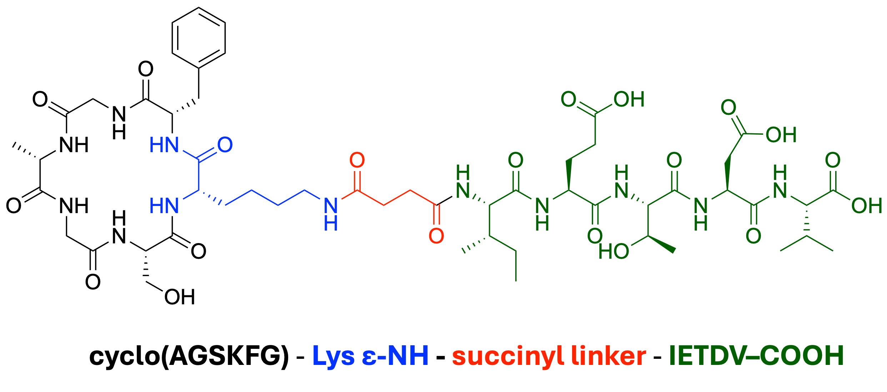
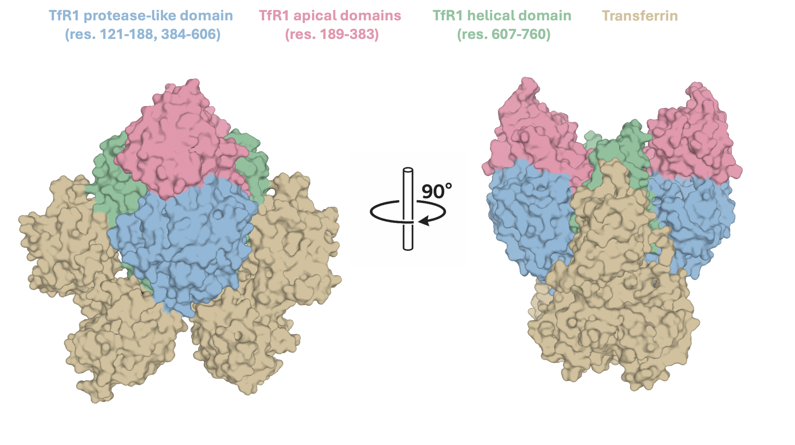
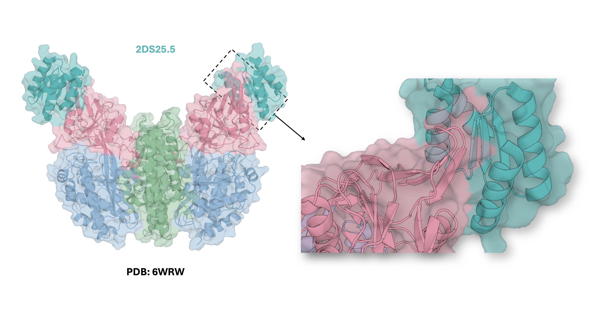
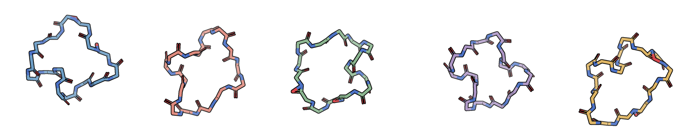
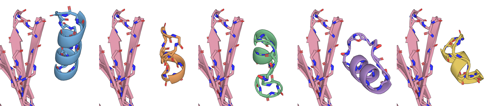
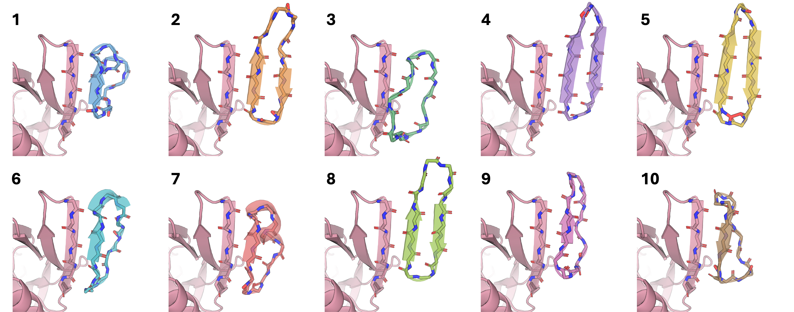
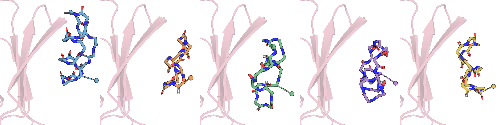
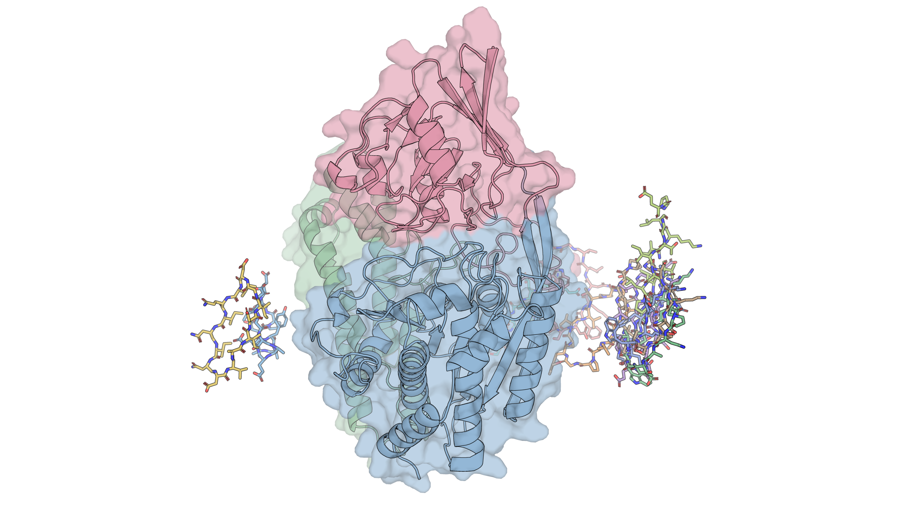

# A Exploration of De Novo Peptide Design for Brain-Targeting Peptides Shuttles Bearing Therapeutic Cargo

By David Kouvchinov, PhD

## Motivation

I am interested in applying for a post-doctoral position regarding the de novo design of brain-targeting peptides in the context of ischemic stroke, as part of a larger interdisciplinary project. Below, I explore some of the background surrounding ischemic stroke, related therapeutic targets, promising leads/clinical efforts, and the use of peptides shuttles to target the brain. This exploration led me to consider that targeting Transferrin Receptor 1 (TfR1) with lariat macrocycles may allow for receptor-mediated transcytosis of PSD-95 inhibitor payloads across the blood brain barrier. Following, I applied the de novo peptide design platform, RFpeptides, to design potential TfR1 binding peptides that may be suitable in this context.

## Background

Stroke is a potentially fatal or otherwise debilitating medical condition in which blood flow to areas of the brain are disrupted. In 2021, it was estimated that almost 1 in 9 deaths globally were due to stroke, with many stroke survivors sustaining serious long-term disability ([Feigin et al., 2024](https://doi.org/10.1016/S1474-4422(24)00369-7)). Strokes are classified as either ischemic, due to a lack of blood flow, or hemorrhagic, due to internal bleeding. Ischemic strokes represent the most common form of stroke worldwide; nearly 65% of strokes are ischemic ([Feigin et al., 2024](https://doi.org/10.1016/S1474-4422(24)00369-7)). Reperfusion therapies (therapies meant to restore blood flow to the affected area) are a critical first-line treatment for acute ischemic stroke. They can be divided into intravenous thrombolysis (administration of a clot-dissolving medication like intravenous alteplase) or mechanical thrombectomy (physical removal of a blood clot with specialized catheters). These therapies are vital and can salvage brain tissue in appropriate contexts, but may be insufficient to attenuate further complex downstream pathology arising from ischemic injury or injury occurring from the reperfusion itself ([Weiss and Ding, 2026](https://doi.org/10.1159/000547092)). This has motivated efforts towards neuroprotective agents that could function as adjunctive therapies to ameliorate such downstream pathophysiology.


Excitotoxicity is one such downstream pathophysiological state of ischemic stroke. It is defined by the neuronal damage caused by the excess release of glutamate and subsequent activation of excitatory cell membrane receptors ([Shen et al., 2022](https://doi.org/10.1016/j.biopha.2022.113125); [Qin et al., 2022](https://doi.org/10.1038/s41392-022-01064-1); [Neves et al., 2023](https://doi.org/10.1016/j.lfs.2023.121814)). At a high level, the process towards excitotoxicity can be described as such: upon loss of blood flow in ischemic conditions, neurons lose access to glucose and oxygen, limiting their capacity to produce ATP. In this low energy state, ion pumps that depend on ATP subsequently begin to fail, disrupting the gradients of Na+/K+/Ca2+ and leading to neuron depolarization. Consequently, glutamate is released (in excess) to the extracellular space. This excess glutamate cannot be entirely cleared by various transporter proteins or other astrocyte processes and instead activates nearby transmembrane glutamate receptors of surrounding neurons, such as N-methyl-D-aspartate receptors (NMDARs). Overstimulation of NMDARs, a subset of ligand-gated ion channels that mediate Ca2+ flux, leads to excess influx of Ca2+ into the neuron and activation of calcium dependent enzymes, cumulatively promoting various cell death signals and general excitotoxic damage.


Considering the prominent role of NMDARs in ischemic excitotoxicity, early approaches towards neuroprotection focused on administration of NMDAR antagonists. Indeed, in rat models of ischemia, focal microinfusion of the NMDAR antagonist, 2-amino-7-phosphonoheptanoic acid, into relevant brain tissue was shown to be neuroprotective against the development of ischemic injury ([Simon et al., 1984](https://doi.org/10.1126/science.6093256)). However, direct antagonism of NMDARs has been associated with neurotoxicity in clinical trials. Selfotel, a small-molecule competitive NMDAR antagonist, was discontinued in phase 3 ischemic stroke trials due to a lack of efficacy and higher mortality in the treatment arm, plausibly due to neurotoxicity ([Davis et al., 2000](https://doi.org/10.1161/01.STR.31.2.347)). Considering that NMDARs mediate essential neuronal excitation in brain regions unaffected by ischemia, more targeted therapeutic strategies have been sought.

One such approach is targeting PSD-95, a scaffolding protein that couples NMDARs to intracellular signaling partners. Through its PDZ domains, PSD-95 can bind C-terminal residues of the NMDAR subunit, NR2B, and the neuronal nitric oxide synthase (nNOS) enzyme, thereby coupling NMDAR activity to the production of nitric oxide and mediating NMDAR-dependent excitotoxicity. Early work demonstrated this potential mechanism by reducing the expression of PSD-95 in cultured coritcal neurons using antisense oligonucleotides ([Sattler et al., 1999](https://doi.org/10.1126/science.284.5421.1845)). This antisense-mediated knockdown reduced NMDAR-activated nitric oxidie production and excitotoxicity without inhibition of the receptor's ionic currents and calcium signaling. Later, this scaffolding was also disrupted by a 20-mer peptide, Tat-NR2B9c (also called "NA-1" or "nerinetide"), composed of the 11 residues of the cell penetrating domain of the HIV-1 Tat protein ("Tat") and the the last 9 C-terminal residues of the NR2B subunit ("NR2B9c") ([Aarts et al., 2002](https://doi.org/10.1126/science.1072873)).

It is not entirely clear which of PSD-95's PDZ domains preferentially binds NR2B-derived peptides versus nNOS, if such a preference exists at all. Though ELISA assays using biotinylated Tat-NR2B9c suggested that its relative preference is >100-fold higher for PDZ2 as opposed to PDZ1 ([Cui et al., 2007](https://doi.org/10.1523/JNEUROSCI.1464-07.2007)), fluorescence polarization competition assays with unlabeled Tat-NR2B9c instead suggested that preference was only modestly in favor of PDZ1 (Kd values: 14 μM at PDZ1, 4 μM at PDZ2, N/A at PDZ3, 10 μM at PDZ1−2) ([Bach et al., 2008](https://doi.org/10.1021/jm800836w)). Similarly, direct fluorescence polarization saturation binding assays of TAMRA-nNOS demonstrated no significant preference for PDZ1 or PDZ2, but greater affinity for PDZ1-PDZ2 constructs (Kd values: 2.4 μM at PDZ1, 1.1  μM at PDZ2, 0.15 μM at PDZ1-2) ([Bach et al., 2015](https://doi.org/10.1038/srep12157)). These findings suggest that targeting either, or perhaps both, domains to inhibit PSD-95 scaffolding of NMDAR/nNOS complexes is a plausible approach. Indeed, a high affinity dimeric bivalent inhibitor of both domains, Tat-N-dimer (Kd: 4.6 nM), was found to also confer neuroprotection in rodent models of ischemic stroke ([Bach et al., 2012](https://doi.org/10.1073/pnas.1113761109)). Clinical development of Tat-N-dimer (synonyms: Tat-NPEG4(IETDV)2, UCCB01-144, AVLX-144) is presently on-going, with Phase 1 trials completed in 2023.


Crucially, to realize the potential of disrupting the ternary complex of NMDAR/PSD-95/nNOS in clinical settings, such therapeutics must be able to effectively cross the blood brain barrier (BBB) to reach injured neurons (in addition to maintaining other ADME requirements of IV drugs). This has been observed for Tat-N-dimer and Tat-NR2B9c, partially by virtue of their efficacy in various rodent model settings as well as fluorescence imaging techniques ([Bach et al., 2012](https://doi.org/10.1073/pnas.1113761109); [Kucharz et al., 2016](https://doi.org/10.1177/0271678X16645595); [Bach et al., 2019](https://doi.org/10.1016/j.neuropharm.2019.02.035)). In the context of Tat-N-dimer and Tat-NR2B9c, the Tat peptide moiety is vital to provide BBB penetration.


Broadly, there are four routes to crossing the BBB: paracellular diffusion (passage between endothelial cells), passive diffusion (passage through the endothelial cell membrane), transport-mediated uptake (a membrane transporter physically moves its substrate across the membrane, such as GLUT1 moving glucose), and transcytosis (the cell engulfs the material into a vesicle that can pass to the abluminal, brain-facing membrane). Transcytosis can be further subdivided into two further classes depending on how the vesicle is formed: adsorptive-mediated transcytosis (AMT, nonspecific adsorption to the surface triggers vesicular uptake) and receptor-mediated transcytosis (RMT, binding to specific receptor triggers vesicular uptake) ([Prades et al., 2025](https://doi.org/10.1021/acs.molpharmaceut.4c01327)). Tat appears to leverage AMT. It is positively charged and interacts nonspecifically with negatively charged cell surfaces prior to vesicle formation. As a consequence, we may expect undesirable nonspecific peripheral tissue uptake, which has indeed been shown for fluorescent Tat-NR2B9c and Tat-N-Dimer ([Kristensen et al., 2020](https://doi.org/10.3390/pharmaceutics12070661)). This may contribute to heart failures observed in a pre-clinical study of Tat-NR2B9c in rodents ([Bach et al., 2019](https://doi.org/10.1016/j.neuropharm.2019.02.035)). Moreover, Tat-NR2B9c is considered to have poor proteolytic stability and potentially insufficient BBB permeability. Factors such as these impact the clinical viability of Tat-NR2B9c and have motivated efforts to conjugate the L- and D-isomers of brain homing peptide, BR1, to Tat-NR2B9c (e.g., D-BR1-Tat-NR2B9c, L-BR1-Tat-NR2B9c) in an effort to improve these properties ([Kolberg et al., 2026](https://doi.org/10.1016/j.ijpharm.2025.126434)). Though the D isomer improved plasma stability, binding affinity and cellular uptake were compromised. Meanwhile, the L-isomer did not ultimately yield greater levels in the brain parenchyma compared to Tat-NR2B9c. It could be envisioned that targeting the RMT mechanism through receptors with preferential CNS expression by stable peptides may provide a more durable, penetrant, and targeted therapy.


De novo design of RMT targeting proteins has previously been reported for Transferrin receptor 1 (TfR1) ([Sahtoe et al., 2021](https://doi.org/10.1073/pnas.2021569118)) and thus serves as a good model system for exploring structure-based de novo peptide design methods. However, it should be noted that while TfR1 is abundantly expressed in the brain, it is not specific to the BBB nor brain tissues ([Zhang et al., 2020](https://doi.org/10.1186/s12987-020-00209-0)). Haqqani et al. provide a useful review of known RMT targets and a perspective on the criteria of what an optimal RMT target is ([Haqqani et al., 2024](https://doi.org/10.3389/fddev.2024.1360302)).


Finally, there has been a revolution of generative protein design methods following the success of AlphaFold2, such as RFdiffusion and Bindcraft, amongst many others in this rapidly developing field (RFdiffusion: [Watson et al., 2023](https://doi.org/10.1038/s41586-023-06415-8); BindCraft: [Pacesa et al., 2025](https://doi.org/10.1038/s41586-025-09429-6)). Yang et al. provide a "state-of-affairs" review on the topic, drawing on many works from the Baker group and providing future-facing perspectives ([Yang et al., 2026](https://doi.org/10.1038/s41586-026-10328-7)). In the following sections, I describe my approach to the selection of ligand modality, protein design methodology, target site selection, and initial efforts towards TfR1 binder design. 
The methods document (`METHODS.md`) contains the code necessary to reproduce my efforts. I note that a majority of the computation was performed on my M2 Max 32GB and the environments and models reflect this.

## Design Considerations, TfR1 Structural Biology, Computational Methods and Initial Results

### "To macrocycle, or not to macrocycle, that is the question."

In my view, there are a few ways to approach the design of a TfR1 peptide binder that can both bind the PDZ domains of PSD-95 and demonstrate reasonable plasma stability. One appealing approach is peptide macrocycles. Given that the project describes the involvement of peptide synthesis, I assume that the chemistry arm of the work is capable of synthesizing various macrocycles using SPPS with a macrocyclization step (or some fairly equivalent synthetic chemistry). Beyond synthetic accessibility, my preference for pursuing macrocycles stems from associations with improved drug-like properties. Macrocycles are often associated with improved binding affinity, higher plasma stability, and improved cellular penetration. Additionally, while most of the recent deep learning methods for de novo protein design seem to have primarily explored proteins or "miniproteins" of roughly 80 or more residues, RFpeptides is designed for macrocycles with experimentally validated designs in the 12–18 residue range (RFpeptides: [Rettie et al., 2025](https://doi.org/10.1038/s41589-025-01929-w)).

A risky element of using a macrocycle is that part of the pharmacophore from AVLX-144 (or NR2B9c) that binds the PDZ domains includes the C-terminal COOH (IETDV-COOH). We may not be able to get away with X-IETDV-Y type designs in our macrocycles. One workaround for this could be a lariat macrocycle. Lariat macrocycles look like lassos, where a macrocycle ring is formed while exposing some side chain or other synthetic handle toward derivatization to a linker (or some desired functionality). We could imagine a lariat macrocycle meant to bind TfR1 while also exposing a linker to connect to IETDV-COOH, such as the example below (Figure 1). 


*Figure 1. Example structure of a lariat macrocycle. Residues identities are color coded.* 

Lysine is not strictly required and other solvent exposed side chains are also amenable, such as the COOH of Asp/Glu or the SH of Cys. The thiol may even be preferred due to related click chemistry. Of course, a concern here is that RFpeptides may be perfectly capable of giving us binders to TfR1, but that conversion to the lariat macrocycle ultimately disrupts it. To me, this seems like a surmountable problem and an interesting design challenge. A linear peptide on the other hand does allow us to just maintain the IETDV-COOH motif, but likely retains the usual risks of peptide stability. It is a question of which risk you are more willing to take. I find the lariat approach both more prudent and exciting. The feasibility of these designs, be it linear peptides or macrocycles, is dependent on what site at TfR1 we would like to target. 

### Structural Biology of TfR1

Transferrin Receptor 1 (TfR1) is 97 kDa type a transmembrane glycoprotein expressed as a homodimer. Amongst other functions, it is one of they key proteins involved in cellular iron update via endocytosis of iron-containing transferrin. Structurally, the two identical monomers are linked by two disulfide bonds at Cys89 and Cys98. The monomers can be divided into three segments: an intracellular cytoplasmic region (res. 1-67), a single transmembrane pass (the extracellular stalk, res. 68-88), and a large soluble extracellular domain (the ectodomain, res. 89-760). The extracellular domain can be divided into several segments: the protease-like domains (res. 121-188 and 384-606), the apical domain (189-383), and the helical domain (res. 607-760). Transferrin, a key substrate of TfR1, binds along portions of the helical and protease-like domains. An annotated structure of the transferrin bound TfR1 (PDB: 39SL) is given below in Figure 2 ([Eckenroth et al., 2011](https://doi.org/10.1073/pnas.1105786108)). The associated color legend is consistent throughout later figures.


*Figure 2. Transferrin-bound TfR1 complex (PDB: 3S9L), shown as the deposited biological assembly. TfR1 domains and transferrin are colored according to the legend.*

Sahoe et al., focused on targeting exposed beta strands in the apical domain as to avoid competition with transferrin binding. They pursued a "beta sheet extension" strategy, extending four consecutive strands in the aplical domain of TfR1 to larger sheets in the designed complexes. In the resolved structure of the 2DS25.5 binder complexed with ectodomain of TfR1, three consequtive consecutive strands in their complexed binder (PDB: 6WRW) extend one of beta sheets in TfR1 (Figure 3). 


*Figure 3. Left: TfR1/2D25.5 dimeric complex (PDB: 6WRW), 2D25.5 is in teal. Right: Closer zoom of beta sheet extension between TfR1 and 2D25.5*

The apical domain/2DS25.5 interface is supported by backbone residue interactions from the most distal beta strand of TfR1 (res. 209-212) and the most proximal beta strand of the designed protein (res. 34-37), with helical domains of the binder forming additional contacts and complementary packing with helicies in the apical domain. A PSE file with protein-protein interactions detected by PLIP is available at: `tf1r-pymol/6WRW_PeptideChainC.pse` ([Schake, Bolz et al., 2025](https://doi.org/10.1093/nar/gkaf361)). Towards my goals, avoiding competition with transferrin binding is also prudent to minimize disruption of the receptor's endogenous function. However, binding along the solvent exposed apical domain beta strands with a comparably smaller peptide or macrocycle appears challenging, as it may not be possible to pick up a sufficient amount of interactions to compete with desolvation penalties. Still, I lean towards targeting this region as a first pass. Alternatively, there are a variety of shallow grooves throughout the apical and protease-like domains that could also be considered by hueristics or ranked by binding site detections tools. Cryptic pockets could potentially be ascertained by molecular dynamics.

### RFpeptides Methodology

Methodologically, RFpeptides works similar to the RFdiffusion de novo design workflow. It is useful to start with RFdiffusion methodology and then discuss the changes RFpeptides made after. The basic design process is `backbone generation` -> `sequence design` -> `oracle`. These steps are all highly modular. For example, RFdiffusion can be used to generate a variety of backbones based on conditioning parameters (e.g., binder conditioning, hot spot conditioning, motif conditioning) and auxillary potentials/steered sampling. ProteinMPNN (or another scaffold decoration model) can be used to generate sequences that fit these backbones, in either biased or unbiased manners. AlphaFold2 (or another performant structure prediction model, RF2, ESMFold, etc) can be used to validate/score the designs. It is generally advised to use a model orthogonal to the source of the diffusion model to act as the oracle for the designs, but this is not strictly required.

#### Backbone Generation

RFpeptides works almost identically to the parent RFdiffusion frameworks. A relatively small and clever change is made to allow for macrocycle backbone generation and oracle prediction without retraining any of the models. AlphaFold2, RosettaFold2 and RFdiffusion all have some 2D pair representation (z) of the residues i,j in the query sequence. So the relationship of residue 1 and 2 is z_1_2, residue 1 and residue 2 is z_1_3, etc, forming a table of features like so:

```
2D pair representation z

            res. j
         1   2   3   4 
       ┌────────────────
r   1  │ z11 z12 z13 z14
e   2  │ z21 z22 z23 z24
s.  3  │ z31 z32 z33 z34
i   4  │ z41 z42 z43 z44
```

Featurized in the z_i_j terms here is, amongst other things, the relative positioning (sometimes called residue offset) of the residues, e.g., residue 4 is +3 relative to residue 1 in the table above. If we consider a peptide of length 10, then residue 10 is +9 to residue 1. In the RFpeptides workflow, they apply a "macrocycle offset" to the pair representation in RosettaFold2, RFdiffusion and AlphaFold2. After the halfway point (i.e., residue 6, +5 to residue 1), the positional encoding is instead treated as cyclic instead of a linear. So, at residue 7 we are at -4 to residue 1 instead of +6. The final residue will be -1 relative to the initial residue. Despite the immense amount of transformations that occur through the rest of these networks, this change in 2D relative positioning does indeed transfer all the way to 3D space. To demonstrate, here are five 15-mer macrocycle backbones I generated against Chain A of 6WRW, using only binder conditioning and cyclic residue positioning in RFdiffusion (Figure 4).


*Figure 4. Example macrocycle backbones generated by RFpeptides.*

These macrocycles were simulated at what should be the alpha helical interface between dimers of TfR1. So, fully unconstrained binder generation is likely not preferable here. However, it would be very interesting to see what unconstrained generation would look like if given the full multimeric complex: where does the model "think" a binder should go? Especially if you account for other sites a binder should avoid (e.g., transferrin, PTM residues, ion binding residues, etc). An approach like this was indeed explored in RFpeptides for some targets. Unfortunately, the computational cost, in terms of both time and memory consumption, scales agressively with residue count, and such an experiment is beyond the constraints of my current hardware. But, it is something I'd like to revisit. Instead, I conditioned on the hot spot residues corresponding to the exposed beta strand in the apical domain of TfR1 (res. 209-212, Chain A, PDB: 6WRW) (Figure 5). This is the same site that was targeted by Sahoe et al. 


*Figure 5. Macrocycle backbones generated by RFpeptides with hot spot conditioning at residues 209-212 of TfR1 (Chain A, PDB: 6WRW).*

Hot spot conditioning indeed works. However, here we run into different issues. Of the five backbones I generated, all contain an alpha helical structure at the apical beta strand/binder interface. Some of these are obviously poor, with interfacial carbonyls visibly pointing directly at each other. That is not something I think sequence decoration or physics-based relaxation can entirely rescue, which would, in turn, waste compute on expensive cyclic AlphaFold2 oracle predictions. While scaling backbone generation is likely to yield better complementarity given sufficient sampling time, RFdiffusion has a known propensity towards the generation of alpha helical structures, which maybe unideal at this interface to begin with. 

Purposeful sampling of binder beta strands backbones at the interfacial site would be preferable, as it allows me to pursue a similar beta sheet extension strategy as explored by Sahoe et al. Fortunately, a method for improving this sampling has recently been developed by the Baker Lab in a process they refer to as β-pair targeting ([Sappington et al., 2026](https://doi.org/10.1038/s41467-025-67866-3)). The authors take advantage of that fact that RFdiffusion is already trained with residue secondary structures (allowing specification of the beta strand in the binder, the "SS" block) and an N by N block-adjacency matrix (describing the interactions both within and between the target and the binder, the "ADJ" block). They provide a script that calculates the associated SS/ADJ tensors blocks join that bias the model to generate the desired secondary structure in the binder at a matched adjacency in the target. This approach greatly improved both their *in silico* success rates at β-pair design and delivered experimentally validated binders across several targets.

I implemented β-pair targeting into the RFpeptides workflow. Excitingly, I do not believe this integration has been previously reported, though it is a natural extension of prior work. First, I calculated the SS/ADJ blocks for the intended binder system using the script provided by Sappington et al (see: `interface_tensors/make_interface_tensor.py`). I targeted beta strand residues (res. 209-212) in the apical domain of TfR1 (PDB 6WRW) and set a binder length of 14, with the first four residues defined as members of the beta strand.

My rationale for the choices varied and could likely be iteratively improved through experimentation. The choice of four residues as members of a beta strand was motivated by potential complementarity to the four member beta strand in the target. But, the choice of macrocycle length was essentially arbitrary, this should be tuned to a combination of the experimental demands of peptide synthesis and design considerations. The residue indicies for the beta strand in the binder are *somewhat* arbitrary, as long as they are contiguous, given the cyclical nature of the macrocycle. However, one could imagine purposefully designing a second complementary beta strand in the macrocycle to support internal beta sheet formation, which I think is an exciting future direction. This relates back to design considerations in the macrocycle length. For example, there may be some ideal length that yields designs with a complementary internal beta sheets. This may, in turn, preconfigure the design for more potent binding. Other lengths could better result in designs that yield complementary packing along nearby alpha helicies in the apical domain. These deserve experimentation. 

Following, I ran the RFpeptides backbone generation for 10 designs, with additional arguments to support β-pair targeting. Of the 10 designs generated, four of them have recognizable beta strand geometry in the binder (see 2, 4, 5, 8) with some reasonable backbone complementarity to the target. Gratifyingly, the N-C macrocycle structure was maintained throughout. Still, the designs may have issues. While I am getting some of the desired beta strand geometry/backbone interactions, most of the macrocycle residues are not interacting with the target. This is not unprecedented for "side-on" macrocycle binding, but it leaves precious few contacts to interact with.


*Figure 6. Macrocycle backbones generated by RFpeptides with β-pair targeting at residues 209-212 of TfR1 (Chain A, PDB: 6WRW)*

One possible improvement here is to select wider range of residues in the β-pairing adjacency matrix to cover more of the strand, as well as selecting additional hotspots (e.g., res. 340-345) to attempt helical interactions with the target. Presently however, diffusing just these 10 designs required nearly ~24 hours of uninterrupted compute on my M2 Max 32GB, so my ability to iterate quickly is limited. For now, I'd like to transition to my in the design process.

#### Sequence Decoration via ProteinMPNN & Rosetta Relax

In RFpeptides, sequences are decorated and the resulting macrocycle minimized by iterative rounds of ProteinMPNN and Rosetta Relax, prior to the AfCyc oracle. This differs somewhat from the more "canonical" RFdiffusion workflow, which did not find that implementing a physics-based minimization step systemically improved *in silico* success rate (percentage deemed to pass by the oracle). However, these findings appear highly empirical, as work across other benchmarks indicates the opposite. Ultimately, the rationale for Rosetta Relax in RFpeptides appears to be motivated by potentially increase sequence diversity through small, local changes in the macrocycle backbone geometry in between ProteinMPNN rounds, Later, physics-based metrics from Rosetta are also used to select candidates for synthesis. 

As described in the original report, I ran four iterative rounds of ProteinMPNN/Rosetta Relax on the apical domain macrocycles. ProteinMPNN allows selecting which residue in the macrocycles we want to constrain. I wanted to ensure an Asp/Glu/Lys/Cys was available at the most distal site relative to TfR1 for conjugation to the lariat macrocycle. I chose a simple hueristic in which we select the residue that corresponds to the most distal "pseudo-CB" (+- 0.5A) that points away from the apical domain as the intended derivatization site (see: `scripts/select_distal_site.py`). A visualization of those selected residues are given below, the line and sphere correspond to the intended directionality of Asp/Glu/Lys/Cys.


*Figure 10. Visualization of the selected backbone residue for Asp/Glu/Lys/Cys sequence generation. The lines and spheres represent the idealized geometry of Asp/Glu/Lys/Cys side chains.*

In RFpeptides, the ProteinMPNN sampling temperature was set to `0.0001`, which strongly favors the model’s highest scoring amino acid choices. In my hands, this setting failed to generate valid sequences when paired with residue constraints. Instead, I used a sampling temperature of `0.1`, the standard ProteinMPNN default, which did successfully generate sequences for all backbones. 

#### AfCyc Oracle

After decorating the backbones, an oracle is used to assess whether the indended design is predicted to fold as expected and whether the oracle is confident in that prediction. In RFpeptides, AfCyc and cyclic RF2 were used to refold complex. The designs were scored by it's similarity to the oracle's prediction, the model's confidence (interface predicted aligned error (iPAE)), and metrics calculated by Rosetta (calculated binding affinity (ddG), spatial aggregation propensity (SAP) of the designed macrocycle and the molecular surface area of the interface contacts (CMS)). 

I refolded the ten design with AfCyc. Unfortunately, none of the designs folded as diffused. Instead, these are all "floating binders", with the exception of one complex, none of them areaeven within 5A of a residue in the target. The iPAE values (mean 27.87 ± 0.36 Å) are uniformly poor and I did not proceed with Rosetta calculations.


*Figure 11. AfCyc refolding of all the macrocycle design shows floating binders.*

It is difficult to assess or interpert the computational validity of this approach due to the limited sampling performed. To my knowledge, the combination of RFpeptides and B-pair conditioning has not been benchmarked. However, indepedently, both methods exhibit substantial target dependent score distributions. It may be the case that the chosen site was particularly difficult and that substantially larger sampling campaigns could produce coherent designs. Moreover, the macrocycle size, hot spot residues, and beta pairing could likely all be iteratively optimized to generate binders with better complementarity to the receptor. Presently, the computational demands of either scaling the present design or exploring alternative designs are prohibitive. Future directions will explore methods of expediting the present workflow (e.g., residue cropping during diffusion) or alternative design platforms that are better suited for my machine. 

## Closing Thoughts

Despite the present lack of good binders, this was a really engaging project! There are so many things to explore in future efforts. Perhaps there is a more relevant RMT target, or a better approach to brain peptide shuttles, or maybe alternative models and software to better execute their designs? All of these are possible and require a more thorough read of the literature and ideally, discussion with fellow colleagues. The community around these protein design methods is particularly fantastic, there are many incredible resources, videos, presentations, and lectures freely available online. There is a huge push to make these tools accessible and to invite new scientists into their field. 

Regarding the present work, there are many other things I wish I could have tried (many of which are discussed in the text), but it is very computationally demanding to run the RFpeptides pipeline on Apple Silicon. For the 10 binders I discussed here, the diffusion run was ~ 24 hours and the oracle was ~ 8 hours. It would be fantastic to dramatically increase the throughput so I could try new ideas quickly with large sample sizes. I should see if I can get away with residue cropping in the backbone generation step, but regardless I've heard that its wise to give the oracle the entire structure for more reliable prediction (iPAE is an averaged metric overall). 

I have heard that RFD3 is dramatically faster than RFdiffusion, often more performant in protein design tasks, and the documentation says it supports Apple MPS. The downside is that it doesn't have the same cyclic encoding machinery nor any validation of its capacity to generate experimental macrocycle binders. Nonetheless, I am interested in familiarizing myself with it's architecture and code to see if I can implement that cyclic encoding somehow! I think that might be my next personal project. In a similar vein, the oracle prediction is pretty slow. I have heard great things about ESMFold2, but they clearly state it does not have MPS support. I haven't yet researched what structure prediction tools are both performant and well suited to my computational set up. It is likely a different oracle will need the cyclic encoding implemented as well. It would be great to have access to NVidia GPUs! That alone would really broaden the ecosystem of tools I could explore.

In the meanwhile, I'll keep reading and tinkering. There is a lot more to learn about all the topics I've tried to cover here. 